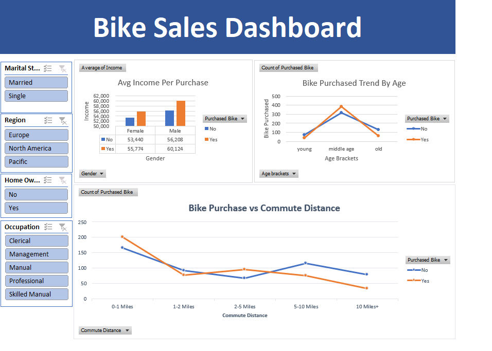

# Bike Sales Data Analysis (Excel Project)

## 📊 Overview
This project analyzes bike sales data using Microsoft Excel. It demonstrates data cleaning, transformation, pivot table analysis, and dashboard creation.

## 🧩 Project Structure
- Raw_Data → Original dataset
- Cleaned_Data → Processed and cleaned data
- Pivot_Analysis → Pivot tables for insights
- Dashboard → Interactive dashboard with charts and slicers

## 🔧 Tools Used
- Microsoft Excel
- Pivot Tables
- Charts (Bar, Line, etc.)
- Slicers

## 📈 Key Insights
- Customer demographics affecting bike purchases
- Income vs purchase trends
- Region-wise sales distribution

## 📷 Dashboard Preview

## 🚀 Skills Demonstrated
- Data Cleaning
- Data Analysis
- Data Visualization
- Business Insights
